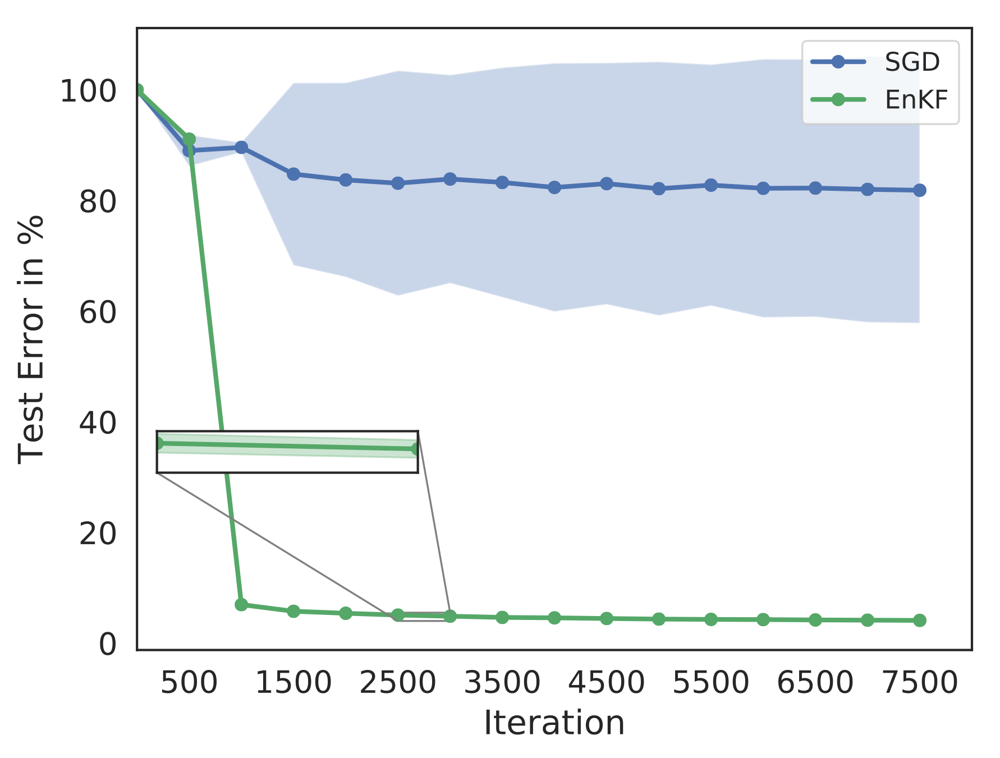

# Code Repository for the Paper Ensemble Kalman Filter optimizing Deep Neural Networks: An alternative approach to non-performing Gradient Descent

## Description 
The Ensemble Kalman Filter(EnKF) can be used as an alternative optimizer when training neural networks, especially in cases where gradient information is not available or backpropagation not applicable.

<figure>

  <figcaption>Figure 1 of the manuscript. It depicts the test error of a Convolutional Neural Network on the MNIST dataset optimized by Stochastic Gradient Descent and Ensemble Kalman Filter. The shaded area shows the standard deviations of ten different runs. Each dot is the test error done on a test set independent of the training set.</figcaption>
</figure>

## Prerequisites
To run the experiments please see [code/README.md](code/README.md)

